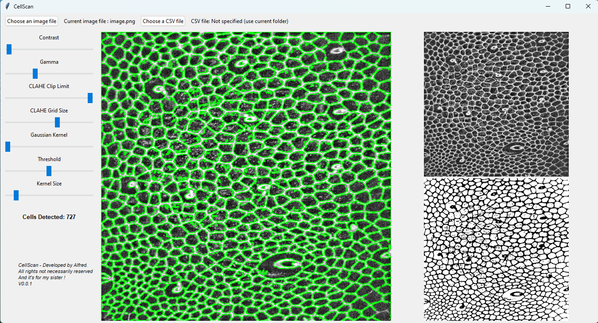

# CellScan
CellScan is an open-source biological image analysis application designed to help researchers and biology professionals efficiently detect, analyse and quantify cells in microscopic images.



## Features

- **Automatic Cell Detection & Analysis**: Identify, count, and measure cells in high-resolution images accurately.
- **Customizable Image Processing**: Adjust parameters like contrast, gamma, brightness, and more to enhance image clarity and precision in analysis.
- **Exportable Data**: Save cell counts and area measurements to CSV, enabling easy data integration with research workflows.
- **User-Friendly Interface**: Built with Tkinter for a simple and accessible GUI.
- **Cross-Platform Compatibility**: Runs on Windows, macOS, and Linux.

---

## Installation

1. **Clone the Repository**:
   ```bash
   git clone https://github.com/yourusername/CellScan.git
   cd CellScan
